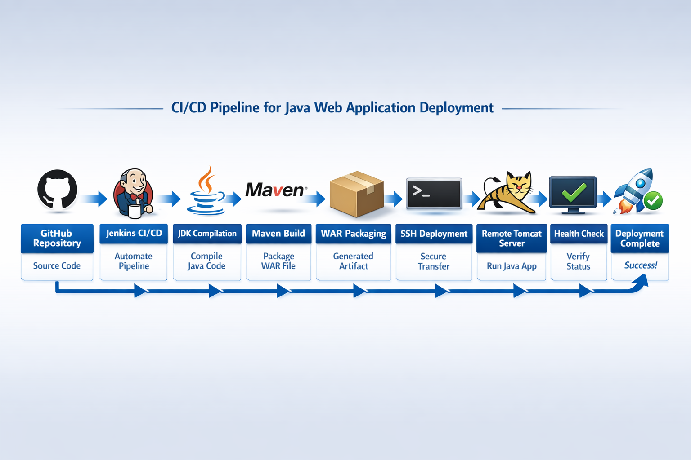
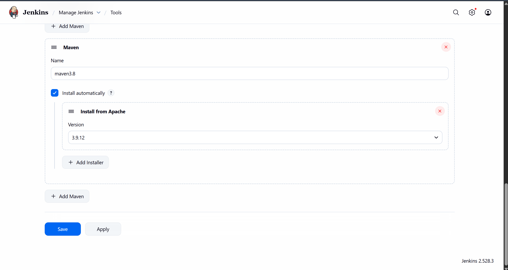
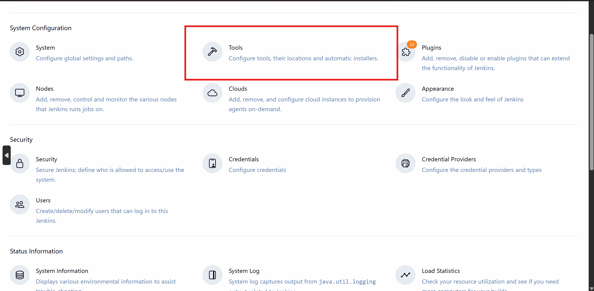
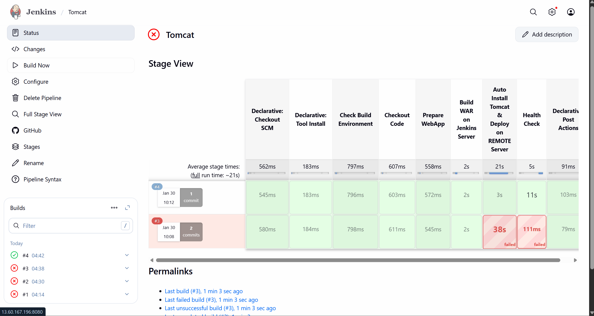

# 🚀 Tomcat Jenkins Maven Deployment Pipeline

**Project:** Automated Deployment of a Java Web Application to Tomcat using Jenkins CI/CD Pipeline

**Tech Stack:**

* Jenkins (CI/CD)
* Maven (Build Tool)
* JDK 21 (Java)
* Tomcat 10 (Web Server)
* GitHub (Source Code Repository)
* SSH (Remote Deployment)


---

## 📌 Project Overview

This project demonstrates a **fully automated pipeline** that:

1. Checks the build environment (JDK & Maven).
2. Pulls the latest code from GitHub.
3. Prepares the Java web application for deployment.
4. Builds a WAR file on the Jenkins server using Maven.
5. Automatically installs Tomcat on a remote server if not present.
6. Deploys the WAR file to Tomcat.
7. Performs a health check to confirm deployment.

The pipeline is **one-click deployment**, making CI/CD smooth and efficient.

---

## 🛠️ Prerequisites

* Jenkins server with `ssh-agent` plugin installed.
* Remote server with Ubuntu (or Debian-based) access.
* SSH credentials added in Jenkins (Credential ID used in pipeline).
* GitHub repository containing the Java web application.
* Maven and JDK installed on Jenkins agent.

---

## ⚙️ Configure Jenkins Tools (JDK & Maven)

🔍 **Mapping old vs new Jenkins UI:**

| Old Jenkins Name                           | New Jenkins UI           |
| ------------------------------------------ | ------------------------ |
| Global Tool Configuration                  | Tools ✅                  |
| Manage Jenkins → Global Tool Configuration | Manage Jenkins → Tools ✅ |

That Tools icon (🔧 hammer) is exactly what we need.

### 🟦 Configure JDK (jdk21)

1️⃣ Under **JDK** section, click **Add JDK**.

2️⃣ Fill details exactly like this:


* **Name:** jdk21
* ✅ Check **Install automatically**
* **Version:** JDK 21

📌 OR (if Java already installed):

* Uncheck auto-install
* **JAVA_HOME:** `/usr/lib/jvm/java-21-openjdk-amd64`

### 🟦 Configure Maven (maven3.8)

1️⃣ Under **Maven** section, click **Add Maven**.

2️⃣ Fill details:

* **Name:** maven3.8
* ✅ Check **Install automatically**
* **Version:** 3.8.x

🔹 Step 3: Click **Save**

**Very important ⚠️** Scroll down → Save

🔹 Step 4: Run Pipeline Again 🚀

Now this block in your Jenkinsfile will work perfectly:

```groovy
tools {
    jdk 'jdk21'
    maven 'maven3.8'
}
```

✅ **How to confirm it worked (Console Output):**

```
openjdk version "21"
Apache Maven 3.8.x
```

No more red errors 🎉

🧠 **Remember:** In modern Jenkins, Global Tool Configuration = Tools. Tool names are logical labels and must exactly match Jenkinsfile.

---

## 💡 Notes

* Ensure SSH credentials (`SSH_CRED_ID`) are correctly set in Jenkins.
* WAR file is deployed as the `ROOT.war`, replacing the default Tomcat app.
* The pipeline can be reused for multiple Java web applications by updating GitHub repo and server IP.

---

---
👩‍🏫 **Guided and Supported by [Trupti Mane Ma’am](https://github.com/iamtruptimane)**  
---

👨‍💻 **Developed By:**  
**Shivam Garud**  
🧠 *DevOps & Cloud Enthusiast*  
💼 *Automating deployments, one pipeline at a time!*  
🌐 [GitHub Profile](https://github.com/Shivamgarud8)
🌐 [Medium blog](https://medium.com/@shivam.garud2011)
🌐 [Linkedin](https://www.linkedin.com/in/shivam-garud/)
🌐 [PortFolio](https://shivam-garud.vercel.app/)


